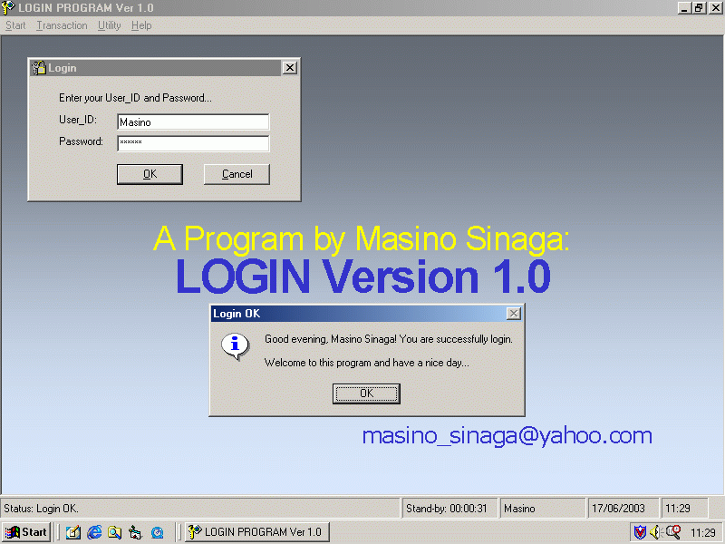



## A Complete Secure Login Program With User Management And Some Database Utilities

### Description

This project shows you how a user login to program and access menu based on his/her level. Program will display every possibility fails message whenever user failed try to login. The chances for login are only 3 times. After that, user must try again from begining. I also made a form to manage user account, that can be accessed only by user with level 'Admin'. Password field was encrypted in database. 'Admin' can manage all user accounts (add, edit, update, delete, change password, decrypt password, view user activity that saved in database, convert/transfer user activity data to log text file, and view that log text file). User can change his/her password. If user level is 'Operator' or 'Manager', he/she can only change his/her own password, but 'Admin', he can change all password user, and his too, of course. And I made menu to compact, repair, and backup database to manage your database performances. I use database Access97 password protected. I also made setting menu to change program setting (run program at startup - this will be occured if you had made an .exe file named 'LOGIN.exe', display screen saver if program idles in for a certain time, protect screen saver with user password, and don't show tips at startup. There is a 'Tips of Day' which display its data from text file. You can learn how to make a tips form and display the tips form or hide it at startup. The user activities that saved in database can be transfered to text file, and this log text file can be displayed from this program, too. So, user activities data can be transfered to text file, and you can delete the records from database. This will reduce your database file size. I made a screen saver form with analog clock. I used Thaha Husain's code to make the needle clock movement (just like a clock in your wall). Thanks to Husain for this code. Screen saver cannot be interrupted by 'Ctrl-Alt-Del', 'Alt-F4', 'Ctrl-Break', etc. Only active/current user can quit form screen saver. If user quit from this program, there will be an offers from program whether your computer would be shut down directly by program or not. Well, that's all I think. Hope it's very useful for you. Any comments, feedback, and votes would be appreciated. Thank you.
 
### More Info
 

             |
---                |---
**Submitted On**   |2003-06-18 08:52:44
**By**             |[Masino Sinaga](https://github.com/Planet-Source-Code/PSCIndex/blob/master/ByAuthor/masino-sinaga.md)
**Level**          |Intermediate
**User Rating**    |4.7 (182 globes from 39 users)
**Compatibility**  |VB 6\.0
**Category**       |[Databases/ Data Access/ DAO/ ADO](https://github.com/Planet-Source-Code/PSCIndex/blob/master/ByCategory/databases-data-access-dao-ado__1-6.md)
**World**          |[Visual Basic](https://github.com/Planet-Source-Code/PSCIndex/blob/master/ByWorld/visual-basic.md)
**Archive File**   |[A\_Complete1605936262003\.zip](https://github.com/Planet-Source-Code/masino-sinaga-a-complete-secure-login-program-with-user-management-and-some-database-utili__1-46446/archive/master.zip)

